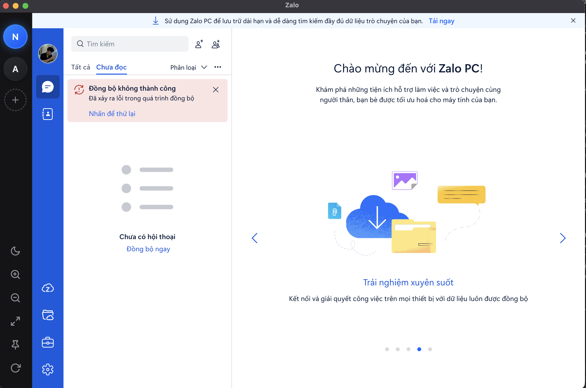

# Dép Lào

<p align="center">
  
</p>

<p align="center">
  <strong>Nguyễn Đình Thọ</strong><br>
  Open Source Developer * Web Developer * Indicator Crypto
</p>

<p align="center">
  <a href="https://t.me/tiodev71">💬 Telegram</a> ·
  <a href="https://www.facebook.com/tiodev71/">📘 Facebook</a>
</p>

---

**DepLao** là ứng dụng quản lý Zalo đa tài khoản (Multi-Account) chuyên nghiệp — được xây dựng trên nhân Chromium siêu tốc và bảo mật.

<p align="center">
  
</p>

## 🛠️ Cài đặt & Sử dụng

### Yêu cầu
- [Node.js](https://nodejs.org/) phiên bản LTS (20.x trở lên)

### Chạy thử môi trường Dev
```bash
npm install
npm start
```

### Build phần mềm (.exe)
```bash
# Tạo file cài đặt (.exe)
npm run build

# Hoặc tạo bản portable (không cần cài đặt)
npm run build:portable
```

### Các bước cài chi tiết
```bash
Bước 1: Cài đặt các thư viện phụ thuộc (Rất quan trọng)
Trước khi build, ứng dụng cần tải về các thư viện cần thiết để hoạt động. Vẫn ở cửa sổ đó, bạn gõ lệnh sau và nhấn Enter:
npm install

Bước 2: Chỉnh sửa file package.json
- Bạn mở thư mục Deplao-App-main (cửa sổ bên phải trong ảnh của bạn).
Tìm file có tên là package.json.
Click chuột phải vào file đó, chọn Open with (Mở bằng) -> chọn Notepad (hoặc bất kỳ trình soạn thảo văn bản nào bạn có).
- Đổi tên ứng dụng cho hợp lệ
Trong file vừa mở, bạn nhìn ngay những dòng đầu tiên, sẽ thấy một dòng trông như thế này:
"name": "Dép Lào", hoặc "name": "Dép Lào@1.1.0",
Bạn hãy sửa cụm từ đó thành một cái tên hợp lệ, ví dụ:
"name": "deplao", hoặc "name": "deplao-app",
(Lưu ý: Chỉ dùng chữ cái thường, viết liền hoặc dùng dấu gạch ngang, không dấu tiếng Việt, và giữ nguyên dấu ngoặc kép "").

Bước 3: Vẫn tại cửa sổ lệnh màu đen đó, bạn gõ lệnh sau rồi nhấn Enter để chủ động cài đặt công cụ electron-builder:
npm install electron-builder --save-dev

Bước 4: Cài đặt công cụ ở chế độ toàn cục (Global)
Nếu cách 1 vẫn không được, chúng ta sẽ cài công cụ này thẳng vào hệ thống cốt lõi của Windows để nó luôn nhận diện được ở bất kỳ đâu.
- Bạn gõ lệnh này và nhấn Enter:
npm install -g electron-builder
(Chữ -g có nghĩa là global. Bạn đợi một lát cho máy tải về xong nhé).
```

File thành phẩm sẽ xuất hiện trong thư mục `dist/`.

### Xuất bản Cập nhật (Dành cho Developer)
Để sử dụng tính năng **Auto Updater**, hãy chạy lệnh build sau (yêu cầu cấu hình `GH_TOKEN` environment variable):
```bash
npm run build -p always
```
Sau đó tạo Release mới trên Github và đính kèm 2 tệp trong thư mục `dist`: `DepLao Setup 1.0.0.exe` và `latest.yml`.

## 📂 Cấu trúc dự án

| File / Thư mục | Chức năng |
|------|-------|
| `main.js` | Quản lý vòng đời App, Hệ thống Partitions, BrowserView, IPC. |
| `renderer.js` | Logic điều khiển Sidebar đa tài khoản, Modal UI. |
| `index.html` | Khung Sidebar & Modal Overlay. |
| `preload.js` | Cầu nối an toàn bảo mật giữa DOM và Backend. |
| `custom_style.css`| Giao diện Dark Glass và tùy biến CSS cho Zalo. |
| `preview.png` | Ảnh Dummy giao diện hiển thị. |

## ⚠️ Lưu ý Bảo mật & Giới hạn
- Mọi dữ liệu (Session, Cookies) được mã hóa và lưu tại `AppData` của máy cá nhân. DepLao **KHÔNG** gửi bất kỳ dữ liệu nhạy cảm nào ra máy chủ bên ngoài.

---

